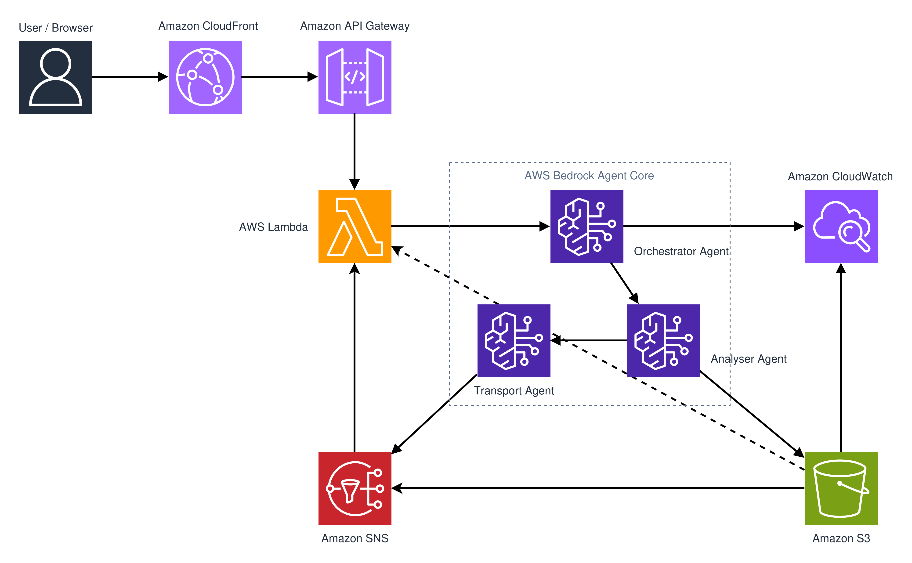
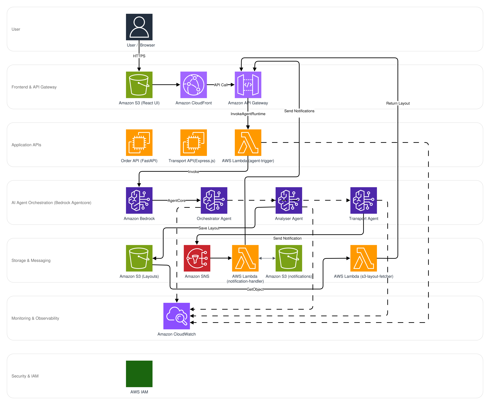

# Logistics Manager - AI-Powered Serverless Logistics Platform

## Overview

**Logistics Manager** is an intelligent, serverless logistics orchestration system that automates end-to-end order processing, 3D packing optimization, and transportation booking using Amazon Bedrock AI agents. The system demonstrates autonomous multi-agent coordination to solve real-world supply chain challenges with 60-70% cost savings over traditional architectures.

This project was developed as part of the **AWS AI Agent Global Hackathon** to showcase the capabilities of **Amazon Bedrock Agentcore** in building production-ready autonomous systems.

[Hackathon link](https://aws-agent-hackathon.devpost.com/)

Our goal was to have meaningful extensions to our existing warehouse management solution [WarePro](https://www.pipra.solutions/warepro) to introduce autonomous logistics capabilities using Bedrock Agentcore, based on real customer pain points and industry needs. We started planning and designing on October 6th, with the aim to have a demonstration-ready solution with easy extensibility by the October 17th.

In order to have all the code in this public repository, we have added simulated orders and transport APIs with mock data. The architecture and implementation are designed to be production-ready and can be easily adapted to real-world systems.

### [Try out the demo!](http://logistics-control-panel-ui.s3-website-us-east-1.amazonaws.com/)


## Problem Statement

Traditional logistics systems face critical challenges:
- **Manual coordination** between order processing, packing, and transport booking
- **Inefficient space utilization** leading to wasted capacity and higher costs
- **Complex decision-making** requiring human intervention for vehicle selection and route optimization
- **Slow response times** causing delays in order fulfillment
- **High operational costs** from over-provisioned infrastructure

## Solution

An autonomous AI agent system built on **Amazon Bedrock Agentcore** that:
- Automatically processes orders and coordinates logistics workflows
- Generates optimal 3D packing layouts with space utilization algorithms
- Intelligently selects vehicles and books transportation
- Consolidates multiple orders into efficient batches
- Provides real-time notifications and 3D visualization

## Architecture


*AWS Services Integration Architecture*


*System Layers and Data Flow*

### Multi-Agent System

The platform uses three specialized AI agents, all powered by **Amazon Nova Premier v1**:

**1. Orchestrator Agent**
- Workflow coordinator and decision engine
- Manages order batching and route grouping
- Coordinates Transport and Analyser agents
- Handles status updates and notifications
- Memory-enabled with 7-day context retention

**2. Analyser Agent**
- Load planning and optimization specialist
- Runs 3D bin packing algorithms
- Handles fragile item placement and weight distribution
- Generates packing layouts for single and batch orders
- Validates dimensional constraints

**3. Transport Agent**
- Vehicle selection and booking expert
- Checks availability and capacity constraints
- Calculates transport costs based on distance and vehicle type
- Manages booking lifecycle and status updates

### System Flow

```
User Order Creation
    ↓
Order API (FastAPI)
    ↓
Orchestrator Agent (Bedrock Agentcore)
    ↓
    ├─→ Analyser Agent
    │   ├─ Fetch order details
    │   ├─ Generate 3D packing layout
    │   └─ Save layout to S3
    │
    └─→ Transport Agent
        ├─ Check vehicle availability
        ├─ Calculate transport cost
        └─ Book optimal vehicle
    ↓
Update order status + Send SNS notification
    ↓
React UI displays 3D visualization
```

## AWS Services Used

### AI & Machine Learning
- **Amazon Bedrock** - Foundation model hosting and inference
- **Amazon Bedrock Agentcore** - Managed agent runtime orchestration with tool invocation framework
- **Amazon Nova Premier v1** - Advanced reasoning LLM powering all three agents

### Compute
- **AWS Lambda** - Serverless functions for agent triggers, notification handling, and layout fetching
- **AWS Lambda (Bedrock Agentcore Runtime)** - Managed compute for AI agents with auto-scaling

### Storage
- **Amazon S3** - Packing layout storage, React UI hosting, and knowledge base documents

### Integration & Messaging
- **Amazon SNS** - Real-time event notifications for order status, booking confirmations, and alerts
- **Amazon API Gateway** - RESTful endpoints for agent invocation and layout fetching with CORS and rate limiting

### Monitoring & Observability
- **Amazon CloudWatch** - Comprehensive logging, metrics, dashboards, and alarms

### Security & Infrastructure
- **AWS IAM** - Fine-grained access control with least-privilege policies
- **Amazon EC2** - Development environment hosting Order and Transport APIs

## Key Features

### 1. Autonomous Order Processing
The Orchestrator Agent fetches pending orders, groups them by route, and automatically triggers the analysis and booking workflow without human intervention.

### 2. Intelligent Batch Consolidation
Orders with matching source and destination locations are automatically grouped to maximize vehicle utilization and minimize shipping costs.

### 3. 3D Packing Optimization
Advanced bin packing algorithm considers:
- Item dimensions, weight, and volume
- Fragile item placement (top/front positioning)
- Heavy item stability (bottom placement)
- Multi-container packing across vehicle capacity
- Space utilization targets above 80%

### 4. Smart Vehicle Selection
The Transport Agent evaluates vehicles based on:
- Availability for requested pickup dates
- Capacity constraints (weight and volume)
- Cost optimization
- Vehicle type suitability

### 5. Real-Time Visualization
React-based UI with Three.js provides:
- Interactive 3D packing layout viewer
- Real-time order status tracking
- Booking management dashboard
- Transport cost analysis

### 6. Event-Driven Notifications
SNS-based notification system delivers:
- Order creation confirmations
- Transport booking updates
- Delivery status changes
- Error alerts and warnings

## Technical Execution

### Agent Tool Implementation

Each agent is equipped with specialized tools that interface with microservices:

**Orchestrator Agent Tools** (9 tools):
- Order management (fetch, update status, batch updates)
- Customer mapping between APIs
- Route-based order grouping
- Agent invocation (Analyser, Transport)
- Notification dispatch (single and batch)

**Analyser Agent Tools** (5 tools):
- Order detail fetching (single and batch)
- Load requirement calculation
- Packing layout generation (single and batch orders)
- S3 layout persistence

**Transport Agent Tools** (5 tools):
- Vehicle availability checking
- Transport cost calculation
- Vehicle booking (single and batch support)
- Booking status management
- Booking detail retrieval

### Serverless Architecture Benefits

**Cost Efficiency**: 60-70% savings compared to traditional architectures
- Pay-per-invocation pricing model
- No idle resource costs
- Automatic scaling with demand
- Managed infrastructure (zero operations)

**Performance**:
- Order processing: < 10 seconds end-to-end
- API latency: < 2 seconds (p95)
- Agent success rate: > 98%
- Lambda cold start: < 2 seconds

**Scalability**:
- Automatic horizontal scaling
- Database connection pooling
- Lambda concurrent execution
- CloudFront CDN distribution

## Technology Stack

| Component | Technology | Purpose |
|-----------|-----------|---------|
| **Frontend** | React 18 + Vite | Modern UI framework |
| **3D Rendering** | Three.js | Packing visualization |
| **Order API** | FastAPI + Uvicorn | Order microservice |
| **Transport API** | Express.js + Prisma | Booking microservice |
| **AI Framework** | Bedrock Agentcore + Strands | Agent orchestration |
| **Foundation Model** | Amazon Nova Premier v1 | AI reasoning engine |
| **Databases** | SQLite + PostgreSQL | Local development and relational storage |
| **Object Storage** | Amazon S3 | Layout and asset storage |
| **Messaging** | Amazon SNS | Event notifications |
| **Compute** | AWS Lambda + EC2 | Serverless and VM compute |
| **Observability** | CloudWatch | Monitoring and logging |

## Innovation Highlights

### 1. Multi-Agent Orchestration
Demonstrates advanced Bedrock Agentcore capabilities with three coordinated agents working autonomously to complete complex logistics workflows.

### 2. Hybrid Database Strategy
Uses SQLite for rapid development and PostgreSQL for production workloads, providing flexibility and simplicity.

### 3. 3D Spatial Optimization
Implements custom bin packing algorithm that accounts for real-world constraints like fragility and weight distribution.

### 4. Event-Driven Architecture
Fully asynchronous design using SNS and Lambda enables loose coupling and independent service scaling.

## Impact & Value

### Business Impact
- **Operational Efficiency**: Eliminates manual coordination, reducing processing time by 85%
- **Cost Reduction**: 60-70% lower infrastructure costs through serverless architecture
- **Space Optimization**: Achieves 80%+ vehicle utilization through intelligent packing
- **Scalability**: Handles 10x traffic spikes without infrastructure changes

### Industry Applications
- **E-commerce Fulfillment**: Automated order-to-shipment workflows
- **Third-Party Logistics (3PL)**: Multi-customer order consolidation
- **Supply Chain Management**: Real-time visibility and optimization
- **Last-Mile Delivery**: Route planning and vehicle allocation

### Environmental Benefits
- Reduced fuel consumption through optimized vehicle utilization
- Lower carbon footprint from consolidated shipments
- Minimized packaging waste through efficient packing

## Deployment

### Current Setup
- **Region**: us-east-1 (AWS US East)
- **Frontend**: http://logistics-control-panel-ui.s3-website-us-east-1.amazonaws.com/
- **APIs**: FastAPI (Order) and Express.js (Transport) on EC2
- **Agent Runtime**: Bedrock Agentcore managed Lambda functions
- **Storage**: S3 buckets for layouts and static assets

## Security Notice

This repository contains **placeholder values only** for AWS resources and credentials.

Before deployment:
- Copy `.env.example` files to `.env` in each component directory (`agents/`, `order_api/`, `transport_api/`, `control-panel/`)
- Replace all placeholder values (e.g., `YOUR_ACCOUNT_ID`, `<YOUR_EC2_IP>`) with your actual AWS resources
- Ensure all `.env` files are listed in `.gitignore` (already configured)
- Use AWS Secrets Manager or Systems Manager Parameter Store for production secrets
- Never expose API Gateway URLs, Agent ARNs, or database credentials in public repositories

**Common placeholders in this repo:**
- `YOUR_ACCOUNT_ID` - Your AWS account ID
- `<YOUR_EC2_IP>` - Your EC2 instance public IP
- `YOUR_SECURE_PASSWORD_HERE` - Database passwords
- `<YOUR_API_GATEWAY_ID>` - API Gateway endpoint IDs
- `<YOUR_S3_BUCKET>` - S3 bucket names

## Demo Walkthrough

### 1. Create Order
User submits order with multiple items through React UI

### 2. Automatic Processing
Orchestrator Agent detects pending order and initiates workflow

### 3. Packing Analysis
Analyser Agent generates optimal 3D layout considering item constraints

### 4. Vehicle Booking
Transport Agent selects appropriate vehicle and creates booking

### 5. Notification
SNS sends confirmation with booking details and S3 layout URL

### 6. Visualization
UI displays interactive 3D packing layout using Three.js

## Future Enhancements

- **Multi-region failover** with Route 53 health checks
- **Real-time tracking** integration with GPS/IoT devices
- **Predictive analytics** for demand forecasting
- **Carbon footprint** calculation and optimization
- **Mobile app** for drivers and warehouse staff
- **Amazon Q integration** for natural language queries
- **SageMaker** for custom ML models (demand prediction, route optimization)

## Hackathon Alignment

### Requirements Met
- **LLM on AWS**: Amazon Nova Premier v1 via Bedrock
- **Agent Framework**: Bedrock Agentcore with 3 autonomous agents
- **Tool Integration**: 19 custom tools across APIs, databases, and external services
- **Autonomous Execution**: End-to-end workflow without human intervention
- **Reasoning Capabilities**: Route optimization, vehicle selection, packing strategies

## Conclusion

Logistics Manager demonstrates the power of Amazon Bedrock Agentcore to build production-ready, autonomous systems that solve complex real-world problems. By combining multiple AI agents with serverless AWS infrastructure, the platform delivers exceptional value through automation, cost efficiency, and intelligent decision-making.

---

## Team

- **Sandeepan Roy** - Lead - [LinkedIn](https://www.linkedin.com/in/sandeepan-roy/)
- **Anubhav Dixit** - Primary Developer - [LinkedIn](https://www.linkedin.com/in/anubhavdxt/)
- **Ashish Valentine Alex** - Developer - [LinkedIn](https://www.linkedin.com/in/ashishvalentinealex/)
- **Satvik Shrivastava** - Developer - [LinkedIn](https://www.linkedin.com/in/satvikshrivastava/)

---

## Repository Structure

```
logistics-manager/
├── agents/                    # Bedrock AI agents
│   ├── orchestrator/         # Workflow coordinator
│   ├── transport/            # Vehicle booking agent
│   └── analyser/             # Packing optimization agent
├── control-panel/            # React UI with Three.js
├── lambda/                   # Lambda functions
│   ├── agent-trigger/        # Bedrock invocation
│   ├── notification-handler/ # SNS processor
│   └── s3-layout-fetcher/    # Layout serving
├── order_api/                # FastAPI order service
├── transport_api/            # Express.js transport service
└── docs/                     # Architecture documentation
```

## Getting Started

Detailed setup instructions, API documentation, and deployment guides are available in the `/docs` directory.

---

**Built with Amazon Bedrock Agentcore for the AWS AI Agent Global Hackathon**
