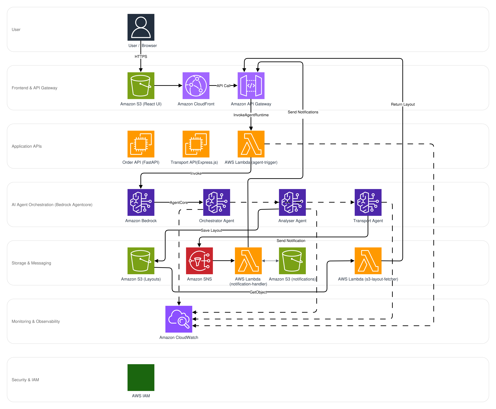

# AWS Services Reference Guide

## Complete AWS Services Inventory

**Total Services Used: 10**


*Figure 1: AWS Services Integration Map*

---

### Core AI & ML Services (3)

**1. Amazon Bedrock**
- **Purpose**: Foundation model hosting and inference
- **Usage**: Hosts Amazon Nova Premier v1 model for all agent reasoning
- **Configuration**: us-east-1 region, model ID: `us.amazon.nova-premier-v1:0`
- **Invocations**: ~1000/month during development

**2. Amazon Bedrock Agentcore**
- **Purpose**: Managed AI agent runtime with tool orchestration
- **Usage**: Runs 3 autonomous agents (Orchestrator, Transport, Analyser)
- **Features**: Session management, tool invocation framework, memory integration
- **Timeout**: 120-300 seconds per agent
- **Cost**: ~$5-20/month at development scale

**3. Amazon Nova Premier v1**
- **Purpose**: Advanced reasoning LLM
- **Usage**: Powers all agent decision-making, tool selection, and natural language understanding
- **Context Window**: Large context for complex logistics reasoning
- **Performance**: Sub-second inference for most queries

---

### Compute Services (2)

**4. AWS Lambda**
- **Purpose**: Serverless compute for event-driven functions
- **Functions Deployed**:
  - `agent-trigger`: Invokes Bedrock agents from API Gateway
  - `notification-handler`: Processes SNS events and sends alerts
  - `s3-layout-fetcher`: Retrieves packing layouts from S3
- **Configuration**: 512MB memory, 30-120s timeout
- **Invocations**: ~500-1000/month
- **Cost**: Free tier covers most usage
- **Note**: Bedrock Agentcore also uses managed Lambda compute for AI agent execution

**5. Amazon EC2**
- **Purpose**: Virtual server hosting for development/demo
- **Instance**: t3.small (2 vCPU, 2GB RAM)
- **OS**: Ubuntu 22.04
- **Services Hosted**: FastAPI Order API, Express.js Transport API
- **Configuration**: Elastic IP, Security Groups (ports 80, 443, 22)
- **Cost**: ~$15-20/month

---

### Storage Services (1)

**6. Amazon S3**
- **Purpose**: Object storage for layouts, UI, and knowledge base
- **Buckets**:
  - `logistics-packing-layouts`: Stores JSON packing layouts (~1GB)
  - `logistics-control-panel`: Hosts React UI static files (~5MB)
  - `logistics-agent-knowledge`: Stores knowledge base documents
- **Features**: Versioning enabled, lifecycle policies
- **Access**: IAM role-based access
- **Cost**: ~$0.03/month for 1GB + 1000 requests

### Database Services (Non-AWS)

**SQLite** (Order API - Development)
- **Purpose**: Lightweight embedded database for order management
- **File**: `database.db`
- **Features**: Zero configuration, serverless, file-based
- **Tables**: Orders, Customers, Products, OrderItems

**PostgreSQL** (Transport API - Production)
- **Purpose**: Relational database for transport bookings
- **ORM**: Prisma
- **Tables**: Vehicles, Customers, Bookings
- **Features**: ACID compliance, complex queries, indexed lookups
- **Hosting**: EC2 instance (development), RDS (production-ready)

---

### Integration & Messaging (2)

**7. Amazon SNS**
- **Purpose**: Event-driven notification system
- **Topics**:
  - `logistics-notifications`: Order status, booking confirmations, alerts
- **Subscribers**: Email, SMS, Lambda functions
- **Events**: Order created, transport booked, delivery completed, errors
- **Cost**: ~$0.50/month for 1000 notifications

**8. Amazon API Gateway**
- **Purpose**: RESTful API endpoints with rate limiting
- **Endpoints**:
  - `/invoke-agent`: Triggers Orchestrator Agent
  - `/layouts`: Fetches packing layouts from S3
- **Features**: CORS enabled, rate limiting (50 req/min per customer)
- **Integration**: Lambda proxy integration
- **Cost**: Free tier covers ~1M requests/month

---

### Monitoring & Observability (1)

**9. Amazon CloudWatch**
- **Purpose**: Centralized logging, metrics, and monitoring
- **Log Groups** (6):
  - `/aws/bedrock-agentcore/logistics-orchestrator`
  - `/aws/bedrock-agentcore/logistics-transport`
  - `/aws/bedrock-agentcore/logistics-analyser`
  - `/aws/lambda/agent-trigger`
  - `/aws/ec2/logistics-order-api`
  - `/aws/ec2/logistics-transport-api`
- **Metrics Tracked**:
  - Agent invocation count and latency (p50, p95, p99)
  - Error rates and success rates
  - Order processing time
  - API response times
- **Dashboards**: Custom dashboard for order metrics and cost tracking
- **Alarms**: Error rate thresholds, latency alerts
- **Retention**: 7 days (development), 30 days (production)
- **Cost**: ~$2-5/month

---

### Security & Infrastructure (1)

**10. AWS IAM**
- **Purpose**: Identity and access management
- **Roles Created**:
  - `bedrock-agent-runtime-role`: Allows agents to invoke Bedrock, access S3, publish to SNS
  - `lambda-execution-role`: Lambda function permissions
  - `ec2-instance-role`: EC2 API access
- **Policies**: Least-privilege access with explicit resource ARNs
- **Features**: Role assumption, temporary credentials
- **Cost**: Free

---

## System Architecture Layers


*Figure 2: Layered System Architecture*

---

## AWS SDK Usage

### Node.js SDK (Lambda Functions)
- `@aws-sdk/client-bedrock-agentcore`: Agent invocation
- `@aws-sdk/client-s3`: Object storage operations
- `@aws-sdk/client-sns`: Notification publishing

### Python SDK (Agents & APIs)
- `boto3`:
  - `bedrock-agentcore` client: Agent invocation
  - `s3` client: Layout storage and retrieval
  - `sns` client: Event notifications
- `sqlalchemy`: Database ORM for SQLite/PostgreSQL

---

## Service Integration Map

```
User Request
    ↓
S3 (React UI)
    ↓
API Gateway → Lambda (agent-trigger)
    ↓
Bedrock Agentcore (Orchestrator Agent)
    ├─→ Bedrock (Nova Premier v1)
    ├─→ Lambda (Analyser Agent)
    │   ├─→ EC2 (Order API - SQLite)
    │   └─→ S3 (save layout)
    ├─→ Lambda (Transport Agent)
    │   └─→ EC2 (Transport API - PostgreSQL)
    └─→ SNS (notifications)
        └─→ Lambda (notification-handler)
    ↓
CloudWatch Logs & Metrics
```

---

## Service Selection Rationale

### Why Bedrock Agentcore?
- Managed agent runtime eliminates infrastructure management
- Built-in tool invocation framework
- Auto-scaling for concurrent users
- Pay-per-use pricing
- Native integration with Bedrock models

### Why SQLite + PostgreSQL?
- **SQLite** for rapid development iteration
  - Zero configuration required
  - No separate database server
  - Perfect for local testing
- **PostgreSQL** for production reliability
  - ACID compliance for transactional integrity
  - Rich query capabilities with Prisma ORM
  - Battle-tested at scale
  - Easy migration to RDS when needed

### Why S3?
- Simple object storage for JSON layouts
- Low cost for infrequent access
- No minimum size charges
- Direct integration with Lambda
- 99.999999999% durability

### Why Lambda over EC2?
- Zero infrastructure management
- Sub-second cold start times
- Automatic scaling
- Pay only for execution time
- Native CloudWatch integration

---

## Future AWS Services (Roadmap)

- **Amazon RDS**: Managed PostgreSQL for production
- **Amazon Q**: Natural language interface for logistics queries
- **Amazon SageMaker**: Custom ML models for demand forecasting
- **AWS Secrets Manager**: Secure credential storage
- **Amazon CloudFront**: CDN for React UI
- **AWS Step Functions**: Visual workflow orchestration
- **Amazon EventBridge**: Event-driven architecture expansion
- **AWS App Runner**: Simplified API deployment (alternative to EC2)

---

**Total AWS Services Used**: 10 services
**Core Services**: Bedrock, Bedrock Agentcore, Lambda, S3, SNS, CloudWatch, API Gateway
**Security & Infrastructure**: IAM, EC2
